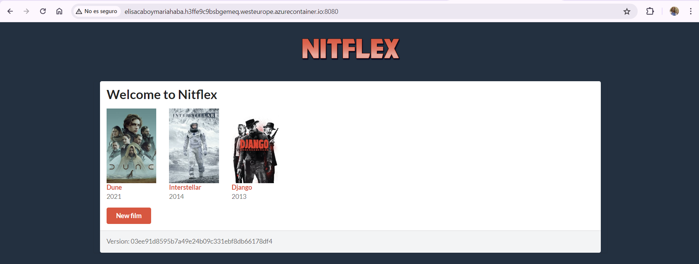

# MEMORIA PRÁCTICA 4 - DEFINICIÓN DE WORKFLOWS 

## Realizada por Elisa Cabo y María Haba
### Datos adicionales de las alumnas: 

71323542J → e.cabo.2019@alumnos.urjc.es 

54197190J → m.haba.2019@alumnos.urjc.es 

## URL del repositorio de GitHub

https://github.com/mariahaba/ais-e.cabo-m.haba-2024-ghf

## URL de la aplicación desplegada en Azure

http://elisacaboymariahaba.h3ffe9c9bsbgemeq.westeurope.azurecontainer.io:8080

